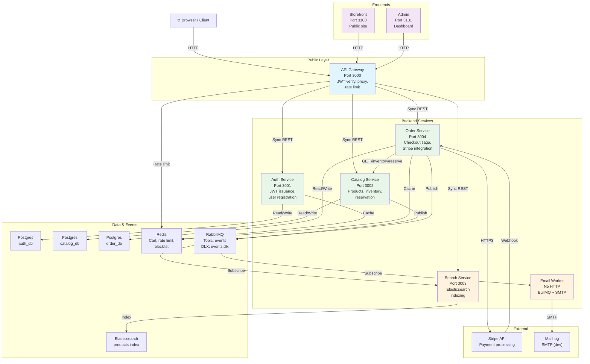
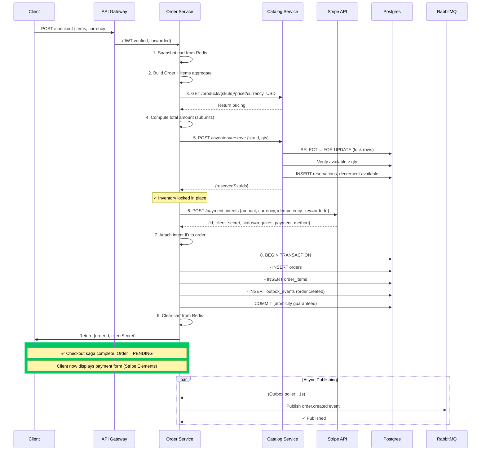
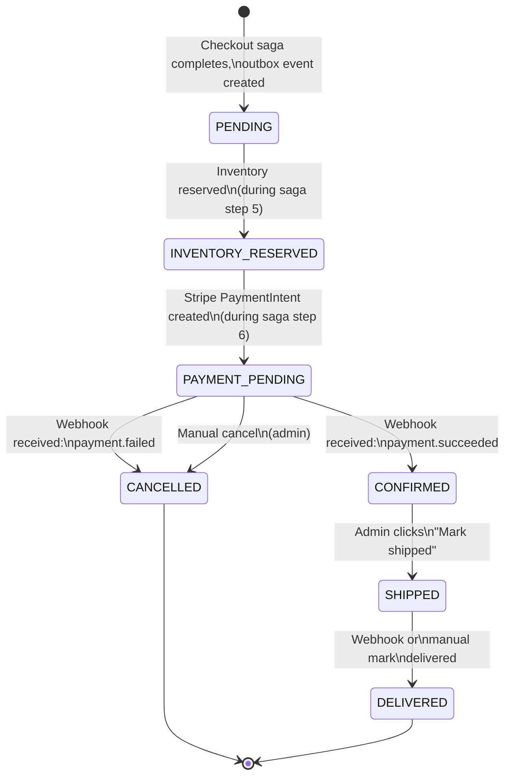

# System Architecture & Communication Patterns

**Purpose:** Understand how services interact, how data flows through the system, and how the checkout saga handles failures.

---

## Service Topology



---

## Communication Patterns

### Synchronous (REST via API Gateway)

**Request Flow:**
1. Client → API Gateway (JWT in Authorization header)
2. Gateway verifies JWT (RS256, jose library)
3. Gateway injects user projection: `{sub, email, role}` → `req.authUser`
4. Gateway reverse-proxies to downstream service (undici HTTP client)
5. Service processes request, returns response
6. Response streamed back to client

**Services (Sync RPC):**
- Order Service → Catalog Service: `POST /api/v1/inventory/reserve` (during checkout saga, blocks until response)
- Stripe Webhook → Order Service: `POST /api/v1/webhooks/stripe` (external call, signature-verified)

**Guarantees:**
- Request-response model (caller waits for response)
- Timeout: 30 seconds (PROXY_HEADERS_TIMEOUT_MS)
- Fails fast (no retries at gateway level; caller decides)

### Asynchronous (RabbitMQ Topic Exchange + DLX)

**Message Flow:**
1. Service publishes event to RabbitMQ topic exchange `events`
2. Event includes routing key (e.g., `order.created`)
3. Each queue bound to exchange with routing key pattern (e.g., `order.*`, `#`)
4. Subscriber consumes message from named queue
5. On success: ack message
6. On failure (exception, nack): message sent to DLX (Dead Letter eXchange) → `.dlq` queue

**Routing Keys & Subscriptions:**

| Routing Key | Publisher | Subscribers | Action |
|-------------|-----------|-------------|--------|
| `order.created` | Order Service | Search Service (optional), Email Worker (future) | Create order entry, send email |
| `order.confirmed` | Order Service | Email Worker | Send confirmation email |
| `order.cancelled` | Order Service | — | (Reserved for future) |
| `order.shipped` | Order Service | — | (Reserved for future) |
| `payment.succeeded` | Order Service | (via order.confirmed) | Update order status CONFIRMED |
| `payment.failed` | Order Service | — | Update order status CANCELLED |
| `inventory.reserved` | Catalog Service | — | (Audit trail) |
| `inventory.failed` | Catalog Service | Order Service (via saga failure) | Release inventory, cancel order |
| `product.indexed` | Catalog Service | Search Service | Index/reindex product in Elasticsearch |

**Exchange & Queues:**
```
Exchange: events (topic, durable)
├── Queue: order-created (durable, x-dead-letter-exchange: events.dlx)
│   └── Binding: order.created
├── Queue: order-confirmed (durable, x-dead-letter-exchange: events.dlx)
│   └── Binding: order.confirmed
├── Queue: product-indexed (durable, x-dead-letter-exchange: events.dlx)
│   └── Binding: product.indexed
├── Queue: inventory-reserved (durable, x-dead-letter-exchange: events.dlx)
│   └── Binding: inventory.reserved
└── ... (other queues)

DLX: events.dlx (topic, durable)
├── Queue: order-created.dlq
├── Queue: order-confirmed.dlq
├── Queue: product-indexed.dlq
└── ... (one .dlq per main queue)
```

**Guarantees:**
- At-least-once delivery (subscriber may see duplicate; must be idempotent)
- Durable (message persisted on disk, survives broker restart)
- Dead-lettered on failure (enables monitoring, manual replay)
- Prefetch limit per consumer (configurable; prevents overwhelming consumer)

---

## Checkout Saga: 10-Step Flow + 3 Compensation Paths

**Saga Pattern:** Distributed transaction orchestrated by Order Service. Each step can fail; compensation paths roll back previous changes.

### Happy Path (10 Steps)



### Failure Path 1: Inventory Reserve Fails (Compensation)

```
Step 5 FAILS: POST /inventory/reserve returns error (insufficient stock)

Order Service:
  1. Receive error from catalog
  2. COMPENSATION: Cancel order (set status = CANCELLED)
  3. Return error to client: {error: "SKU ABC out of stock"}
  
Result: No order created, no Stripe intent, client retries or browses alternatives
```

### Failure Path 2: Stripe PaymentIntent Creation Fails (Compensation)

```
Step 6 FAILS: Stripe API returns 429 (rate limited), 500 (server error), or network timeout

Order Service:
  1. Catch Stripe error
  2. COMPENSATION Path 1: POST /inventory/release {reservationId} → Catalog
  3. COMPENSATION Path 2: Set order status = CANCELLED
  4. Return error to client: {error: "Payment service temporarily unavailable"}
  
Catalog Service (on release):
  1. Delete reservation rows
  2. Increment available
  3. Decrement reserved
  4. Publish inventory.failed event (audit trail)

Result: Inventory released, order never persisted, no Stripe charge
```

### Failure Path 3: Transaction Commit Fails (Partial Compensation)

```
Step 8 FAILS: Prisma transaction fails (concurrent reservation, DB corruption, etc.)

Order Service:
  1. Catch transaction error
  2. COMPENSATION Path 1: POST /inventory/release {reservationId} → Catalog
  3. COMPENSATION Path 2: DELETE Stripe intent (idempotency_key prevents duplicate charge)
  4. Return error to client: {error: "Order could not be created"}
  
Result: Inventory released, Stripe intent cancelled/unreachable, no order row, client can retry
```

### Webhook Processing (Step 10+)

After client confirms payment (browser → Stripe → redirect):

```mermaid
sequenceDiagram
    participant Stripe as Stripe API
    participant Order as Order Service
    participant Postgres as Postgres
    participant RabbitMQ as RabbitMQ

    Stripe->>Order: POST /webhooks/stripe {stripe_event_id, type: payment_intent.succeeded, data}
    Order->>Order: Verify HMAC-SHA256 signature

    Order->>Postgres: INSERT stripe_webhook_events (stripe_event_id UNIQUE, payload)
    Note over Postgres: ✓ Unique constraint deduplicates replays
    
    Order->>Postgres: SELECT pg_advisory_xact_lock(lockId) for orderId
    Note over Order: ✓ Lock acquired; serializes concurrent saga steps per order
    
    Order->>Postgres: SELECT order WHERE stripePaymentIntentId = ?
    Postgres-->>Order: Return order
    
    Order->>Order: Update order status: PENDING → PAYMENT_PENDING → CONFIRMED
    
    Order->>Postgres: BEGIN TRANSACTION
    Order->>Postgres: - UPDATE orders SET status = CONFIRMED
    Order->>Postgres: - INSERT outbox_events (order.confirmed)
    Order->>Postgres: COMMIT
    
    par Async Publishing
        Order->>RabbitMQ: (Outbox poller) Publish order.confirmed
        RabbitMQ->>Order: Email Worker subscribes, sends email
    end
    
    Note over Stripe,Order: ✅ Payment webhook processed. Order = CONFIRMED
```

---

## Event Flow & Transactional Outbox

### Outbox Table Design

```sql
CREATE TABLE outbox_events (
  id               TEXT PRIMARY KEY,
  routing_key      TEXT NOT NULL,        -- e.g., "order.created"
  payload          JSONB NOT NULL,       -- Serialized event
  created_at       TIMESTAMPTZ NOT NULL DEFAULT NOW(),
  published_at     TIMESTAMPTZ,          -- NULL until published
  
  INDEX idx_unpublished ON (published_at, created_at)
);
```

### Publish Guarantee

```
Domain Mutation + Outbox in Single Transaction:
  BEGIN
    UPDATE inventory SET available = available - 1 WHERE sku_id = ?
    INSERT outbox_events (routing_key, payload, ...) VALUES (...)
  COMMIT
  
✓ Atomicity: Both succeed or both fail; no half-state
✗ Failure mode: Service crash after COMMIT but before poller reads
  → Outbox row exists; poller will eventually publish (1–60s delay)
  
Poller (runs every ~1 second):
  SELECT outbox_events WHERE published_at IS NULL ORDER BY created_at LIMIT 100
  FOR UPDATE SKIP LOCKED
  
  For each event:
    PUBLISH to RabbitMQ topic exchange
    UPDATE outbox_events SET published_at = NOW()
    
✓ Guarantee: No event lost (even if service/poller crashes)
✓ Guarantee: Duplicates possible (at-least-once); subscribers must be idempotent
```

### Example: Order Created Event Flow

```
User clicks "Checkout"
  ↓
Order Service receives request
  ↓
Build Order aggregate + items
  ↓
Reserve inventory (Catalog sync call)
  ↓
Create Stripe PaymentIntent
  ↓
Postgres Transaction:
  INSERT orders → order row created (id=123)
  INSERT order_items → order_items rows created
  INSERT outbox_events (routing_key='order.created', payload={id:123, userId:456, ...})
  COMMIT ✓
  ↓
Return {orderId: 123, clientSecret: ...} to client
  ↓
Outbox Poller (1s later):
  SELECT outbox_events WHERE published_at IS NULL LIMIT 100
  FOR UPDATE SKIP LOCKED
  
  Find row: {routing_key: 'order.created', payload: {...}}
  
  PUBLISH to RabbitMQ exchange 'events' with routing key 'order.created'
  
  Subscribers receive:
    - Search Service (if subscribed): Index order data
    - Email Worker (future): Prepare confirmation email
  
  UPDATE outbox_events SET published_at = NOW()
  COMMIT ✓
  ↓
✅ Event durably published
```

---

## Data Model Overview

### User (auth_db)

```sql
users
├── id (UUID)
├── email (UNIQUE, citext)
├── name
├── passwordHash
├── role (customer | admin)
├── provider (credentials | google)
└── createdAt, updatedAt
```

### Product & Inventory (catalog_db)

```sql
products
├── id (UUID)
├── slug (UNIQUE)
├── name, description
├── categoryId (FK)
├── images (JSON array)
└── isActive (soft delete)

skus
├── id (UUID)
├── productId (FK)
├── sku (UNIQUE)
├── attributes (JSON)
└── createdAt

sku_prices
├── (skuId, currency) UNIQUE
├── unitAmount (integer: USD cents, VND đồng)
└── createdAt

inventory
├── skuId (PK, 1:1)
├── available (integer)
├── reserved (integer)
└── updatedAt

reservations
├── (orderId, skuId) UNIQUE
├── quantity
└── createdAt
```

### Order (order_db)

```sql
orders
├── id (UUID)
├── userId (FK, customer who placed order)
├── status (FSM: PENDING, INVENTORY_RESERVED, PAYMENT_PENDING, CONFIRMED, SHIPPED, DELIVERED, CANCELLED)
├── totalAmount (integer: subunits)
├── currency (USD | VND)
├── stripePaymentIntentId
├── shippingAddress, email, phone
├── cancelReason
└── createdAt, updatedAt

order_items
├── orderId (FK)
├── skuId (FK)
├── quantity
├── unitAmount (snapshot at order time)
├── currency
└── createdAt

order_events (append-only audit trail)
├── id (UUID)
├── orderId (FK)
├── eventType (CREATED, CONFIRMED, SHIPPED, CANCELLED, etc.)
├── payload (JSON: what changed)
└── createdAt

stripe_webhook_events
├── id (UUID)
├── stripeEventId (UNIQUE: deduplication)
├── stripeEventType (payment_intent.succeeded, etc.)
├── payload (raw Stripe event)
├── processedAt (NULL until processed)
└── createdAt

outbox_events
├── id (TEXT)
├── routing_key (order.created, inventory.reserved, etc.)
├── payload (JSON: serialized domain event)
├── created_at
└── published_at (NULL until published)
```

### Cart (Redis)

```
Key: cart:{sessionKey} OR cart:user:{userId}
Value: {
  items: [{skuId, quantity}, ...],
  currency: 'USD',
  createdAt,
  expiresAt: createdAt + 7 days
}
```

---

## Order Status FSM



---

## Multi-Tenancy & Currency Model

### Single-Deployment Model
- **Scope:** One jCool instance = one business/org
- **Users:** Customers (role=customer) + admin staff (role=admin)
- **No org ID:** All data belongs to same tenant implicitly

### Currency Support
- **Supported:** USD (integer cents), VND (integer đồng)
- **Storage:** Integer subunits only (e.g., 2999 = $29.99 USD)
- **Cart:** Single-currency (switching currency clears cart)
- **No FX:** No conversion between currencies (future feature)

### Pricing Example

| Product | Currency | Unit Amount | Client Display |
|---------|----------|-------------|-----------------|
| T-Shirt | USD | 2999 | $29.99 |
| T-Shirt | VND | 750000 | 750.000₫ |

---

## Observability & Tracing

### Correlation ID Propagation

```
Client Request:
  Header: X-Request-Id: abc-123-def-456

API Gateway:
  1. Extract or generate X-Request-Id
  2. Inject into req.authUser context (AsyncLocalStorage)
  3. Forward to downstream service via header
  4. Log with correlation ID

Downstream Service (e.g., Order):
  1. Extract X-Request-Id from header
  2. Store in AsyncLocalStorage
  3. All logs include correlation ID
  4. Forward to RabbitMQ (message header: x-request-id)
  5. Forward to Redis operations (logged)
  6. Forward to Postgres (comment or parameter)

Email Worker (async consumer):
  1. Receive message from RabbitMQ
  2. Extract X-Request-Id from message header
  3. Run message handler in correlation context
  4. All logs include correlation ID
  5. Trace spans linked to original request

Result:
  ✅ Single correlation ID threads across:
     Client → Gateway → Service A → Service B → RabbitMQ → Service C
  ✅ Full end-to-end visibility in logs + traces
```

### Metrics Collection

**Business Metrics:**
- `orders_created_total` (counter): Total orders created
- `revenue_subunit_total` (gauge): Total revenue (USD cents + VND đồng)
- `saga_compensations_total` (counter by step): Failed checkout steps rolled back
- `inventory_reserved_total` (counter): Inventory units reserved

**Technical Metrics:**
- `http_request_duration_seconds` (histogram): Request latency
- `http_request_size_bytes` (histogram): Request body size
- `rabbitmq_publish_lag_seconds` (gauge): Outbox publish lag
- `rabbitmq_dlq_depth_messages` (gauge): Dead-letter queue size
- `postgres_connection_pool_open_total` (gauge): Active DB connections
- `stripe_webhook_replay_total` (counter): Deduplicated replays

---

## Deployment Topology (Local Dev)

```
docker-compose.yml
├── postgres:16 (port 5432)
│   ├── auth_db
│   ├── catalog_db
│   └── order_db
├── redis:7 (port 6379)
│   ├── db0: Auth refresh tokens
│   ├── db1: Search cache
│   ├── db2: Order cart
│   ├── db3: BullMQ (email jobs)
│   └── db4: API Gateway rate limit
├── rabbitmq:3.13 (port 5672, mgmt 15672)
│   ├── Exchange: events (topic)
│   ├── DLX: events.dlx
│   └── Queues: order-*, inventory-*, product-*, .dlq siblings
├── elasticsearch:8.13 (port 9200)
│   └── products index (blue-green alias swap)
└── mailhog:v1.0.1 (SMTP 1025, UI 8025)

docker-compose.observability.yml (optional)
├── prometheus:2.55.1 (port 9090, scrape interval 15s)
├── loki:3.2.1 (port 3100, log aggregation)
├── promtail:3.2.1 (tails Docker logs)
├── tempo:2.6.1 (port 4317 gRPC, 4318 HTTP, trace storage)
└── grafana:11.3.0 (port 3001, dashboards)
```

---

## Security Boundaries

### Public vs. Internal

| Service | Public? | Authentication | Authorization |
|---------|---------|-----------------|-----------------|
| API Gateway | ✅ | JWT RS256 (jose) | Role check (gateway) |
| Auth Service | ✅ (routes: /register, /login only) | None required | None |
| Catalog Service | ✅ (read), ✅ (admin write, gateway enforces) | JWT (gateway) | Role check |
| Order Service | ✅ (checkout, orders endpoints) | JWT (gateway) | User scope (customer sees own orders) |
| Search Service | ✅ (read), ✅ (admin reindex, gateway enforces) | JWT (gateway) | Role check |
| Email Worker | 🔴 Internal only | None (RabbitMQ only) | N/A |

### Secrets Management

| Secret | Storage | Usage | Rotation |
|--------|---------|-------|----------|
| JWT Private Key (RS256) | `.env` (dev), secrets mgr (prod) | Sign access + refresh tokens | Planned (production) |
| JWT Public Key (RS256) | `.env` (dev), secrets mgr (prod) | Verify tokens in gateway + services | Planned (production) |
| STRIPE_SECRET_KEY | `.env` (dev), secrets mgr (prod) | Create PaymentIntents, fetch events | Planned (production) |
| STRIPE_WEBHOOK_SECRET | `.env` (dev), secrets mgr (prod) | Verify webhook signatures (HMAC-SHA256) | Planned (production) |
| DATABASE_URL_* | `.env` (dev), Cloud SQL proxy (prod) | Connect to Postgres | Planned (production) |
| RABBITMQ_URL | `.env` (dev), secrets mgr (prod) | Connect to broker | Planned (production) |
| REDIS_URL_* | `.env` (dev), Cloud Memory (prod) | Connect to cache | Planned (production) |

### PII Redaction

Structured logger redacts paths: `secret`, `password`, `email`, `token` → `***`

```typescript
// Example log output
{
  "timestamp": "2024-06-21T10:30:45Z",
  "level": "info",
  "message": "User registered",
  "email": "***",              // Redacted
  "passwordHash": "***",       // Redacted
  "userId": "abc-123",         // Safe to log
  "stripe_secret": "***",      // Redacted
  "correlation_id": "xyz-789"  // Safe to log
}
```

---

## Failure Modes & Recovery

| Scenario | Detection | Recovery |
|----------|-----------|----------|
| Service crash (e.g., Order Service) | Liveness probe fails; traffic rerouted | Manual restart; no data loss (outbox survives) |
| Postgres down | Connection timeout; 503 error | Data persists on disk; restart broker |
| Redis down | Connection timeout; cart unavailable | Cleared on startup (acceptable for MVP) |
| RabbitMQ down | Connection error; async ops queue | Messages persist on disk; auto-reconnect on restart |
| Stripe API timeout | HTTP timeout (30s) | Saga compensation: release inventory, cancel order |
| Webhook replay (Stripe) | stripe_event_id already exists | Ignored (UNIQUE constraint dedup) |
| Concurrent saga steps (same order) | Race condition possible | Advisory lock serializes steps per order |
| Outbox poller crash | Published_at not updated | Messages remain unpublished; retry on next poll |
| Consumer crash (Email Worker) | Message redelivered from RabbitMQ | BullMQ retry; exponential backoff |

---

## Performance Characteristics

| Operation | Latency (p99) | Throughput | Bottleneck |
|-----------|---------------|-----------|-----------|
| Register user | ~100ms | 1k/sec | Bcrypt cost 12 |
| Login | ~150ms | 1k/sec | Bcrypt verify + DB query |
| Browse products | ~50ms | 10k/sec | Catalog read, no joins |
| Full-text search | ~100ms | 5k/sec | Elasticsearch query |
| Checkout saga | ~400ms | 100/sec | Stripe intent creation (30s timeout risk) |
| Stripe webhook | ~200ms | 1k/sec | Advisory lock contention per order |
| Email dispatch | ~2s (async job) | 100/sec | SMTP delivery |

---

## Architecture Status

Architecture and communication patterns are stable and production-ready for single-region deployment.
